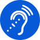
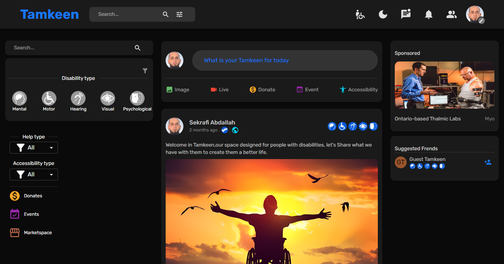
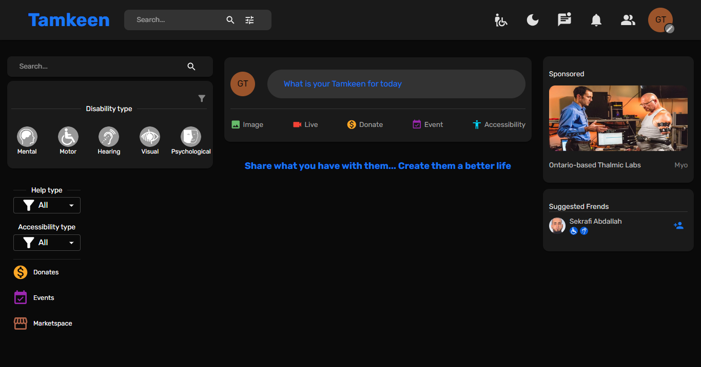

# Tamkeen app :

# CHALLENGE PROMPTS
Tamkeen app is a communication bridge or platform (a network of social communication and solidarity) that brings people with disabilities together with normal people in one virtual place for people with disabilities around the world by connecting service providers ( voluntary, free, and paid) to people with disabilities from companies, organizations, associations, governments, individuals for various disabilities around the world, with the aim of reducing painful perspectives, bridging the gap between the two groups, to bring together services and benefit from to achieve a standard of living worthy of people with disabilities by building Communities based on the concepts of solidarity and sharing.

Tamkeen app is the official assistant for people with disabilities around the world.

# Goals:
- Bridging the gap between disabled people and ordinary people and establishing communication between them.
- Build a single, unified space to help people with disabilities.
- Build space to promote services and policies for people with disabilities.
- A space to pose or ask for help (Tamkeens).
- A space to propose and launch initiatives, campaigns and policies for the promotion of people with disabilities by providing an integrated environment that helps decision-makers make the right decisions.

# Supported disabilities:
- Mental 
- Motor 
- Hearing 
- Visual 
- Psychological 

# `live preview` 
https://tamkeen-one.vercel.app

1) Use :
- Email: guest@tamkeen.com
- Password: tamkeen
- Please write your name when creating a new post

  OR
2) Create a new account with a valid email address:
- You will receive a verification email.
- Click the link to activate your account `this link expires in 1 hour` .
- You can log in.
- Enjoy.

# Contact me for any collaboration:
- LinkedIn: https://www.linkedin.com/in/abdallah-sekrafi-47232889/
- Facebook: https://www.facebook.com/abdallah.sek/

# `Font end part`
`Contact me for the last version V-01-25`
https://github.com/abdallahsekrafi/Tamkeen_font-end

# `Back end part` 
`Contact me for the last version V-01-25`
https://github.com/abdallahsekrafi/Tamkeen_back-end

# Technologies: 
JAVASCRIPT, REACT, MONGOBD, EXPRESS, NODEJS, REDUX, MUI (material UI), CSS, HTML

  
  
  
  
  
  
  
  
  
  
  
  
  
  
  
  
  

# Screenshot:

---------
# Sekrafi Abdallah @ 2024
-------
